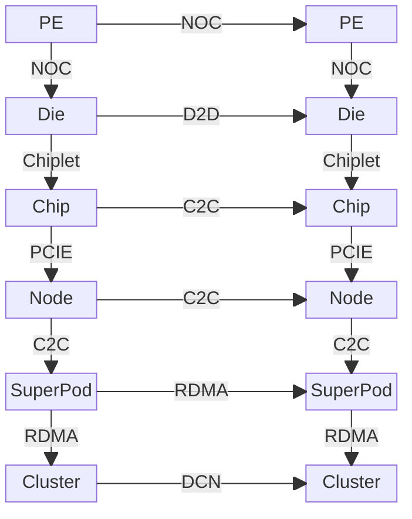

# 架构分析

本部分聚焦超节点的硬件与系统架构，从国内外先进算力产品实践出发，深入分析 Scale-Up 域的技术基础与系统实现。

## 什么是超节点

超节点是借助高速无损互联技术，突破传统计算节点以CPU和PCIe总线为核心的通信边界，构建的新一代计算架构。
**在硬件互联层面**，超节点采用NVLink、CXL或专用交换网络等先进互连协议，在加速卡（GPU/NPU）之间构建了高带宽、低延迟的直接通信域（Scale-Up Domain，或称高带宽域，High Bandwidth Domain, HBD）。
这种设计实现了计算单元间的大规模高效互连，缓解了传统架构中因GPU间通信必须经由CPU与PCIe总线而形成的性能瓶颈，为海量数据并行处理奠定了物理基础。
**在软件与系统层面**，其资源管理范式也随之转变：硬件间的高速通信通常直接绕过（bypass）操作系统内核繁复的协议栈，转而通过用户态集合通信库（如NCCL、HCCL）进行调度，从而显著降低通信开销。

## 超节点的核心价值

超节点通过系统级创新来支撑算力曲线的持续指数级增长。之所以要突破传统的"Scale-Out"扩展AI集群的范式，主要原因在于：

- **通信瓶颈**：PCIe与以太网的带宽增长难以匹配NVLink每两年带宽翻倍的快速增长。以H100为例，NVLink 4.0提供900GB/s的GPU间带宽，而PCIe 5.0 x16仅128GB/s，相差7倍。随着模型规模增长，这种差距会成为整个AI算力集群的核心瓶颈。
- **内存墙问题**：单节点GPU的显存容量有限，单纯HBM的迭代节奏难以满足大模型因模型规模和序列长度而快速增长的显存需求。GPT-4级别的模型需要数TB的显存，远超单节点8卡GPU的容量。
- **扩展效率递减**：在Scale-Out域，算力利用率随节点规模的增长而衰减。

超节点通过"Scale-Up"架构创新地解决了这些问题：在机柜级别构建高速无损互联域，将数十甚至数百个GPU通过NVLink/NVSwitch直接互联，形成一个逻辑上的"超级GPU"。

## 系统分层蓝图

现代AI超算系统的硬件架构遵循自底向上的层次化设计原则，每一层都通过特定的互联技术将计算单元组织成更大规模的计算资源：

1. **层级1 - 芯粒内部 (Die)**: 系统的最基本计算单元是**处理单元 (PE)**，例如GPU中的流式多处理器(SM)。在单个硅片(**Die**)上，众多的PE通过**片上网络 (NoC)**高效互联。
2. **层级2 - 芯片 (Chip)**: 借助先进封装技术(Chiplet)，多个独立的**芯粒 (Die)**被封装在一起，构成一个完整的**芯片 (Chip)**。它们之间通过高速的**Die-to-Die (D2D)**接口（如NV-HBI, UCIe）通信，使其在逻辑上表现得像一个单片大芯片。
3. **层级3 - 节点 (Node)**: 一个服务器**节点 (Node)**通常包含多个**芯片 (Chip)**（如多块GPU）和CPU。节点内的GPU之间通过**芯片间互联 (C2C)**技术（如NVLink + NVSwitch）构建高速通信域，而GPU与CPU之间则主要通过**PCIe总线**连接。
4. **层级4 - SuperPod/HBD**: 节点间以 NVSwitch Fabric/自研协议组成机柜级 Scale-Up 域。
5. **层级5 - 集群 (Cluster)**: 多个**SuperPod**组合成一个**集群 (Cluster)**。SuperPod之间的通信（Scale-Out）依赖于**数据中心网络**，通常使用基于**RDMA**的InfiniBand或RoCE高速网络。

真正的竞争点在于第 3-4 层：如何在机柜级保持低直径、高二分带宽与可重构弹性，同时让编程模型保持简单可用。
