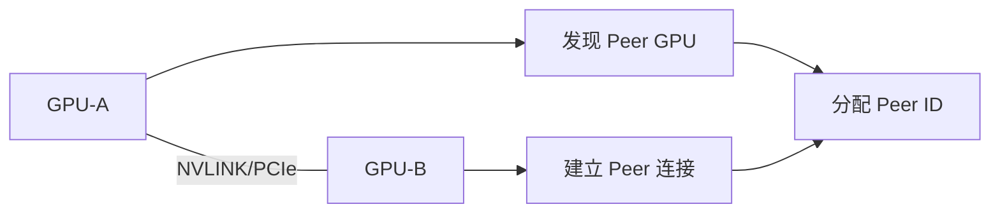
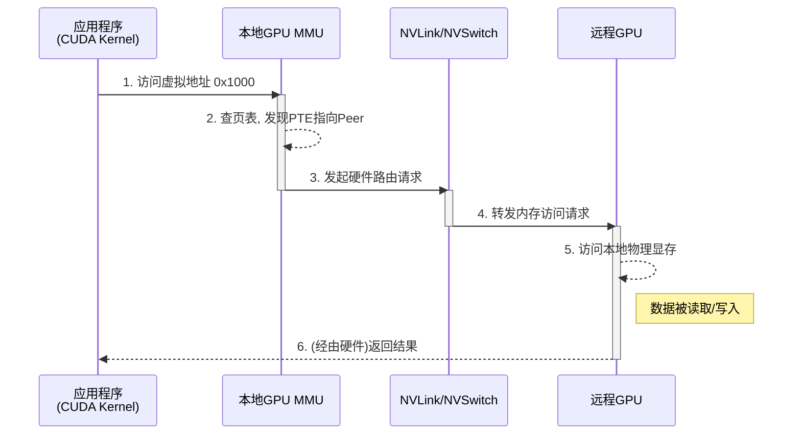

# GPU 访存体系演进

软件系统架构的根本决定因素是内存模型。传统操作系统内核围绕CPU访存权限进行设计，通过虚拟内存管理、页表机制和TLB等组件构建了现代计算的基础。同样，PCIe引入的MMIO（Memory Mapped I/O）机制决定了内核驱动的编程范式，设备寄存器被映射到统一的地址空间，通过内存访问指令进行控制。

超节点的出现从根本上改变了这一范式。通过NVLink/NVSwitch等高速互联技术构建的HBD（High Bandwidth Domain）通信域，使得远程GPU显存能够以接近本地访问的性能被直接访问。为了实现高效通信，HBD域上正在构建一个能**绕过（Bypass）CPU和操作系统内核**的、由GPU主导的通信架构。在这个新架构下，访存的控制权发生了转移：

1. **从CPU中心到GPU中心**：跨GPU的内存访问不再需要CPU作为中介，而是由GPU的MMU（内存管理单元）直接发起，由硬件（如NVSwitch）进行路由。
2. **从内核态仲裁到用户态直通**：上层应用（如CUDA Kernel）通过统一虚拟地址（UVA）操作远程数据，其地址翻译和路由完全在硬件层面透明完成，内核仅在初始设置和资源管理时介入。

为了更好地理解超节点带来的这一变革，接下来从GPU访存体系入手来分析软件系统的演进路径。

## 现代GPU访存体系

NVIDIA超节点在软件系统架构上与其**单个节点内部**的GPU访存体系一脉相承，均围绕**UVA（Unified Virtual Addressing）**技术构建。与传统CPU类似，现代GPU也配备了完整的内存管理单元（MMU），负责虚拟地址到物理地址的转换。UVA技术的引入，将GPU显存、CPU内存等不同物理内存统一映射到单一的虚拟地址空间中。上一章我们讨论了NVLink和NVSwitch等物理互联技术，它们构建了数据传输的高速公路。软件层面利用这条高速公路的核心便是统一虚拟寻址（UVA）与对等内存访问（Peer Memory Access）：

### 1. 发现与连接建立

系统中的GPU通过物理总线（如NVLink或PCIe）互相发现，建立对等连接并分配唯一的Peer ID。

### 2. Aperture选择与地址映射

驱动程序分配UVA地址，并根据连接类型选择不同的Aperture通道：

- **本地显存 (VID Memory)**：同一GPU内的内存访问
- **对等内存 (Peer Memory)**：通过NVLink直接访问远程GPU显存
- **系统内存 (SYS Memory)**：通过PCIe访问CPU主存
- **Fabric内存**：在NVSwitch环境下的专用地址空间

### 3. 硬件透明的远程访存

当CUDA Kernel访问虚拟地址时，GPU MMU自动完成地址翻译和路由。硬件MMU通常提供4-5级页表，支持4K-128K页大小。考虑到MMU页表中的地址可能并非全部是内存地址，也包含部分IO地址。因此GPU MMU的表项也会标识是否支持缓存一致性。

### GPU访问UVA地址流程

以下是GPU上访问UVA地址的流程：

UVA在节点内实现的编程透明性与硬件高效性，为构建更大规模、跨节点的统一地址空间奠定了范式基础。随着硬件演进，软件侧的地址模型与编程范式也在逐步向CPU成熟的体系靠拢。总体趋势是：CPU与OS内核正从"关键数据路径"中解放出来，转而扮演"控制平面"的角色，通过配置虚拟地址与MMU来管理访存与通信，而非直接参与每一次操作。

## 超节点访存体系

传统的UVA和PCIe P2P机制的边界仅限于单个PCIe根联合体（Root Complex），无法原生支持跨物理服务器节点的直接访存。以下是PCIe总线上节点内部的访存体系：

### PCIe 节点内访存体系

1. 主存、设备的控制寄存器和设备内置存储（比如显存）都会通过PCIe RC映射到一个统一的MMIO地址空间（Memory Mapped I/O）；
2. 在内核态，设备驱动通过MMIO地址操作设备寄存器，从而实现对设备的初始化、控制与中断处理；
3. 在用户态，可以直接将设备的存储映射到用户态地址空间，从而实现用户态对设备的直接读写，让数据路径bypass内核。GPU Direct RDMA技术即将部分显存映射到用户态，再交给RDMA网卡去访问。RDMA网卡的doorbell寄存器（用于通知网卡有工作需要处理）也可以通过这种映射交给GPU去访问，从而实现IBGDA（GPU异步RDMA数据发送）；

在传统的基于PC的AI算力服务器上，上述软件技术架构已成为事实标准。然而，在超节点中，上述访存体系面临本质缺陷：PCIe通信域无法纳管其他节点的设备，因此也无法提供跨节点的统一访存地址空间。

### NVSwitch Fabric 全局地址空间

超节点通过NVSwitch Fabric等技术，将"节点内"的P2P模型扩展至整个机柜乃至多个机柜。其关键在于引入了一个由**Fabric Manager**管理的**47-bit的全局物理地址空间**[^fabricmanager]：

1. **全局地址分配**：Fabric Manager为HBD域内的每个GPU分配一个唯一的、在全局范围内无冲突的物理地址（PA）范围。
2. **VA到全局PA的映射**：当一个GPU需要访问远程GPU时，其驱动程序不再映射到对端的PCIe BAR地址，而是将用户态的虚拟地址（VA）通过页表（PTE）映射到这个全局物理地址（PA）。
3. **硬件路由**：当GPU的MMU翻译VA并得到这个全局PA时，它会生成一个带有目标GPU ID的硬件请求。该请求被发送到NVSwitch网络，由交换芯片根据地址和ID，像路由器转发IP包一样，精准地将读写操作路由到目标GPU的物理显存上。

## PCIe/CXL 架构演进

- PCIe 5/6 带宽与链路层重传能力提升，但事务开销仍高于 NVLink；CXL.cache/mem 提供共享内存与一致性语义，成为统一访存的关键
- 多 Root/多层交换：需要规划拓扑、隔离域与 NUMA 亲和，避免跨 RC 瓶颈
- CXL switch 与传统 PCIe switch 的差异：一致性、内存池化、QoS/隔离能力

在机柜级 HBD 里，PCIe/CXL 继续承担"南北向"与"异构设备"连接角色，互联焦点从"带宽够不够"转向"事务开销与一致性够不够"。

## 整机资源编排

- **NUMA 与 GPU/加速卡绑定**：合理亲和性设置减少跨 socket/跨 switch 延迟
- **DMA 映射、IOMMU、安全与虚拟化**：统一的地址映射与隔离策略是共享内存语义的基石
- **异构协同**：GPU/NPU/DPU/可编程交换芯片在同一机箱内的链路规划与带宽分配

## 参考文献

[^fabricmanager]: [NVIDIA Fabric Manager（open-gpu-kernel-modules 源码）](https://github.com/NVIDIA/open-gpu-kernel-modules/blob/2b436058a616676ec888ef3814d1db6b2220f2eb/kernel-open/nvidia-uvm/uvm_gpu.h#L1292)
